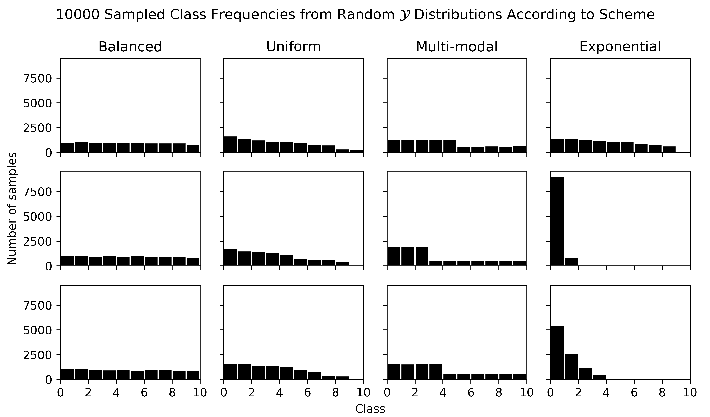

# Contents

- [Contents](#contents)
- [Introduction](#introduction)
  - [Related Work](#related-work)
  - [A Worked Example](#a-worked-example)
- [Samplewise Consistency Metrics](#samplewise-consistency-metrics)
  - [Sources of Variation](#sources-of-variation)
  - [Samplewise Metrics Summarize Along Repetitions](#samplewise-metrics-summarize-along-repetitions)
  - [Paired Samplewise Consistency Metrics](#paired-samplewise-consistency-metrics)
  - [Candidate Metrics](#candidate-metrics)
    - [Error-Based](#error-based)
      - [Set-Based](#set-based)
    - [Prediction-Based](#prediction-based)
    - [Point-Process or Process-Based](#point-process-or-process-based)
  - [Metric Evaluation](#metric-evaluation)
  - [Simulations](#simulations)
    - [Simulation Details](#simulation-details)
    - [Class Distributions](#class-distributions)
- [Appendix A: Generating Discrete Distributions](#appendix-a-generating-discrete-distributions)
- [References](#references)


# Introduction

Deep learning with neural networks (DL) has yielded remarkable advances in [bla bla bla, more
useless intro junk].

However, despite the impressive performance metrics produced by these DL models,
the reproducibility of some of these results is @bouthillierUnreproducibleResearchReproducible2019

Unfortunately, the focus on aggregate performance metrics ignores the question
of the *consistency* or *stability* of those predictions on particular samples.
While in some practical applications (say, recommendation systems), it might
not matter if sample predictions change from update to update, or with each
re-tuning, in other cases, this model drift [cite] may be unacceptable. In
particular, any model predicting risks for human subjects (e.g. risk of
defaulting on a loan, risk of developing a medical condition) should arguably
be highly samplewise-consistent across updates.

## Related Work

- model drift [@lacsonMachineLearningModel2022;
  @nelsonEvaluatingModelDrift2015; @roffeDetectingModelDrift2021] and model
  updating [@moonsRiskPredictionModels2012a;
  @davisCalibrationDriftRegression2018; @davisCalibrationDriftRegression2017;
  @minneEffectChangesTime2012]
- robustness research, including adversarial robustness
- bootstrapped error estimates
- model churn and prediction difference
- ergodicity issues[@molenaarNewPersonSpecificParadigm2009a]


## A Worked Example

For example, in the most extreme pathological case, consider a fictional model
which is consistently always 80% accurate in predicting a need for medical screening
ie.e. it produces the following confusion matrix every time, on a sample of 10 subjects,
80 of which do in fact have the condition (and thus need screening), and 2 which do not:

$$
\begin{array}{c|cc}
\hat{y} \setminus y & P & N \\
\hline
P & 7^a & 1^b \\
N & 1^c & 1^d \\
\end{array}
$$

If subjects that are given a positive test ($\hat{y} = P$) are sent in for
screening, then we incorrectly send in 1 subject, and fail to screen 1
subject. We correctly do not always screen 1 subject. In total, we have
recommended 8 unique individuals for screening after this test.  Let us also
assume that 1 of the predictions that make up cell (a) were basically just
lucky: i.e. only 6 subject that will develop the condition will actually
always test positive. That is, if subjects have ids 0, ..., 9, then cell (a)
always contains subjects 0, 1, 2, ..., 5. Let us also supposed subjects 7 and 8
also are positive (should be tested), and thus that subjects 0, 9 are the actual negatives.

Then documenting only the subjects
that can be "moved around" across classifications, we might have gotten for
the first prediction:

$$
\begin{array}{cccccc}
\text{Cell} & y & \hat{y} & \text{IDs (always)}  & \text{ID (this time)} & \text{Total} \\
\hline
a & P & P & \{0, 1 ,2, 3, 4, 5\} &  7 & 7 \\
b & N & P &          -           &  9 & 1 \\
c & P & N &          -           &  6 & 1 \\
d & N & N &          -           &  8 & 1 \\
\end{array}
$$

That is, true labels and predictions are:

$$\begin{align*}
\text{ID} &= [0, 1, 2, 3, 4, 5 \;\vert\; 6, 7, 8, 9] \\
y         &= [1, 1, 1, 1, 1, 1 \;\vert\; 1, 1, 0, 0] \\
\hat{y}_1 &= [1, 1, 1, 1, 1, 1 \;\vert\; 0, 1, 0, 1] \\
\end{align*}$$

Now suppose we update the model, and the "lucky" 1 subjects from cell (a) are
instead swapped with those in cell (c), and also that the 1 subject in cell (b)
is this time swapped with the one in cell (d).

$$
\begin{array}{cccccc}
\text{Cell} & y & \hat{y} & \text{IDs (always)}  & \text{ID (this time)} & \text{Total} \\
\hline
a & P & P & \{0, 1 ,2, 3, 4, 5\} &  6 & 7 \\
b & N & P &          -           &  8 & 1 \\
c & P & N &          -           &  7 & 1 \\
d & N & N &          -           &  9 & 1 \\
\end{array}
$$

$$\begin{align*}
\text{ID} &= [0, 1, 2, 3, 4, 5 \;\vert\; 6, 7, 8, 9] \\
y         &= [1, 1, 1, 1, 1, 1 \;\vert\; 1, 1, 0, 0] \\
\hat{y}_2 &= [1, 1, 1, 1, 1, 1 \;\vert\; 1, 0, 1, 0] \\
\end{align*}$$


The confusion matrix and even distribution of predictions is unchanged, but every
subject has been classified differently. With just one model update, the entire
population has been classified into the "positive" category at least once, and
the model which appears to be 80% accurate (or e.g. have an $F_1$-score of 70%)
is in fact only consistently predicting 60% of the population.


There are a number of important points to observe from this example:

1. the pathological model behaviour arises in a repeated / iterated context
2. the pathological behaviour requires a notion of persistent *individuality*
   and *identifiability* of  the samples involved
   - if prediction is done using a metric or set of features which does not
     uniquely identify an individual, it is unclear if the above problem is a
     concern
3. the pathological behaviour is invisible from gross / aggregate metrics (accuracy
   F1 score, etc.)
4. the pathological behaviour also cannot be detected by comparing
   the distributions of the class predictions across repetitions


Thus, any metric that can be used to detect this problem *must*
must make use of sample individuality in some way, that it, the metric is defined
through computations that are *samplewise* in some fundamental way.


# Samplewise Consistency Metrics


Given $p$ predictions $Y = \{\hat{\symbfit{y}}_1, \dots, \hat{\symbfit{y}}_p\}$ on the
same $N$ individual samples, i.e.$\hat{\symbfit{y}}_i = f_i(\symbfit{x})$ for each $i$, and $n \le p$,
an **$n$-arity samplewise consistency metric** $\mathcal{C} \in [0, 1]$ is computed across all combinations
of size $n$ of $Y$, i.e. over the $K = \binom{p}{n}$ collections of predictions of the set $\binom{Y}{n}$.
That is, for any permutation $\sigma$ of $\{1, \dots, n\}$ we can state:

$$
\mathcal{C}(\hat{\symbfit{y}}_1, \dots, \hat{\symbfit{y}}_n) = \mathcal{C}(\hat{\symbfit{y}}_{\sigma(1)}, \dots, \hat{\symbfit{y}}_{\sigma(n)})
$$


and can thus enumerate all consistencies as as $\mathcal{C}_1, \dots,
\mathcal{C}_K$, and compute a mean, which we shall simply denote as
$\mathcal{C}$. Then all such $\mathcal{C}$ and must satisfy the basic
conditions:

$$\begin{align*}
& \text{If (and only if) for all } i \ne j \text{ and any } k,  \hat{\symbfit{y}}_i^{(k)} \ne \hat{\symbfit{y}}_j^{(k)},  \text{ then:} & \mathcal{C} & = 0 \\
& \text{If (and only if) for all } i, j \; \hat{\symbfit{y}}_i = \hat{\symbfit{y}}_j \;  \text{ then:} & \mathcal{C} &= 1 \\
& \text{If (and only if) there exists } i, j \text{ such that } i \ne j \text{ and }  \hat{\symbfit{y}}_i \ne \hat{\symbfit{y}}_j  \text{ then:} & \mathcal{C} & < 1 \\
\end{align*}$$

where $\hat{\symbfit{y}}_i = \hat{\symbfit{y}}_j$ if and only if element-wise equality holds, i.e.:

$$\hat{\symbfit{y}}_i^{(k)} = \hat{\symbfit{y}}_m^{(k)} \text{ for } k = 1, \dots, N.$$

That is, $\mathcal{C}$ is zero only when there is perfect disagreement, and
unity only when there is perfect agreement.  Note also, as per the worked
example, and given confusion matrices $A_i$ corresponding to $(\symbfit{y}, \hat{\symbfit{y}})$ pairs, there must not exist
a function $g$ such that

$$
\mathcal{C}(\hat{\symbfit{y}}_1, \dots, \hat{\symbfit{y}}_n) = g(A_1, \dots, A_n)
$$

i.e., the consistency metric must not be completely dependent and/or derivable from
the set of confusion matrices of the predictions.

For this metric to provide interpretable, information, we also require it to have reasonable
behaviour with respect to classifier the accuracies, $a_i = \text{acc}(\symbfit{y}, \hat{\symbfit{y}}_i)$:


$$\begin{align*}
& \text{As all } \hat{\symbfit{y}}_i \text{ approach } \symbfit{y} \text{ (i.e. as } \bar{a} \text{ approaches 1)}:& \mathcal{C}  & \rightarrow 1 \\
\end{align*}$$

However, the converse should not in general be true (perfect consistency can occur when .
predictions are identical, but incorrect), nor will there necessarily be a tendency
for $\mathcal{C} \rightarrow 0$ as $\bar{a} \rightarrow 0$. In particular, when errors
are random, the consistency should be related to observed and/or actual class distributions
in the training and test sets.


NOTE: highly correlated with acc can still be useful because then a disagreement between
acc and consistency metric is a red flag:

Actually, we want something stronger, namely, that we cannot *predict* $\mathcal{C}$ from the
confusion matrices, i.e. consistency metrics should be reasonably *independent* of performance
metrics. We will see that


Note that $k$ above functions as both as the *index* and the *unique identifier* for each sample.

We also define an $n$-arity **samplewise error consistency metric**: given $n$
predictions $\hat{\symbfit{y}}_1, \dots, \hat{\symbfit{y}}_n$ on the same $N$
individual samples, and true labels $\symbfit{y}$, and residual vectors
$\symbfit{r}_i = [\symbfit{y} \ne \hat{\symbfit{y}}_i]$ (where $[\cdot]$ is the
[Iverson bracket](https://en.wikipedia.org/wiki/Iverson_bracket), applied
elementwise, i.e. each $\symbfit{r}_i$ is a vectors of $0$s and $1$s), then
$\mathcal{E}(\symbfit{r}_1, \dots, \symbfit{r}_n) \ge 0$ must satisfy:

$$\begin{align*}
& \text{If there exists } i, j \text{ such that } i \ne j \text{ and }  \symbfit{r}_i \ne \symbfit{r}_j  \text{ then:} & \mathcal{E}(\symbfit{r}_1, \dots, \symbfit{r}_n) < 1 \\
& \text{If for all } i, j \; \symbfit{r}_i = \symbfit{r}_j \;  \text{ then:} & \mathcal{E}(\symbfit{r}_1, \dots, \symbfit{r}_n) = 1 \\
\end{align*}$$


For a consistency or error consistency metric to have value, it should:

- have direct, practical intepretability
- not require particular distributional or independence assumptions
  on $\hat{y}_i$s for interpretation or validity
- contain novel information (not be too strongly-corrlated with simpler statistics)
- be simple to define and compute


Ideally, a good metric also:

- is not overly sensitive to class distributions and number of classes
  in the classification problem
- is sensitive to a discrepancy between prediction distributions and true distributions
- distinguishes between random vs. non-random (dependent) predictions
- \[BONUS]: can be naturally extended to the regression context

## Sources of Variation

Of course, given identical training data and training hyperparameters,
non-stochastic algorithms will necessarily have perfect consistency on any test
set. Consistency metrics are not designed for this case, but for contexts where
there are "small" variations in data and/or procedure, but a consistent /
shared validation set. We are most interested in the cases:

1. **Hyperparameter sensitivity**: $\hat{\symbfit{y}}_i = f(\theta_i;
   \symbfit{x})$ for hyperparameters $\theta_i \in \mathbb{R}^h$ close to some
   tuned or default hyperparamter values $\theta^{\star}$
2. **Training sample variability**: where $\hat{\symbfit{y}}_i = f_i(\symbfit{x})$,
   and $f_i$ differ due to different training data (e.g. bootstrap, k-fold)
3. **Training robustness**: where $\hat{\symbfit{y}}_i = f_i(\symbfit{x})$, and
   $f_i$ differ because each is trained on data $\tilde{\symbfit{x}}_i$, where
   $\tilde{\symbfit{x}}_i$ is some minor perturbation (e.g. addition of noise)
   of the training data
4. Combinations of the above

Thus we always discuss consistency metrics with respect to a source of variance


## Samplewise Metrics Summarize Along Repetitions


Most supervised ML or DL algorithms expect a data matrix or array $\mathbf{X}
\in \mathbb{R}^{N \times \mathbf{F}}$, where $\mathbf{F}$ comprises the
*feature dimensions*, and where there are $N$ samples which form the *sample
dimension or index*. For example, with tabular data $\mathbf{F} = 1$, and with
image data, as in a typical CNN, $\mathbf{F} = \text{C} \times \text{H} \times
\text{W}$ for images with channel, height, and width dimensions. Given targets
$\mathbf{Y} \in \mathbb{R}^{N \times \mathbf{T}}$, where $\mathbf{T}$ can have
almost any dimensionality, like $\mathbf{F}$, then most such algorithms also
can be optimized by choosing a suitable loss function $\mathcal{L}_i$ such that
$\mathcal{L}_i(\hat{\symbfit{y}}_i, \symbfit{y}_i) \in \mathbb{R}$ for each
sample prediction $\hat{\symbfit{y}}_i = f(\symbfit{x}_i)$, where
$\symbfit{x}_i \in \mathbb{R}^{1 \times \mathbf{F}}$ of $\mathbf{X}$, and
likewise $\symbfit{y}_i \in \mathbf{R}^{1 \times \mathbf{T}}$).

This per-sample loss is also usually aggregated (e.g. getting an average loss
in batch-based gradient descent) along the sample dimension, to get an aggregate
loss (typically the mean) for a batch over  $\mathbf{X}$ and $\mathbf{Y}$ defined as above:

$$\mathcal{L}(\symbfit{X}, \hat{\symbfit{Y}}) = \underset{i}{\text{agg}} \left(\mathcal{L}_i(\hat{\symbfit{y}}_i, \symbfit{y}_i) \right)$$

Likewise, there is usually a performance metric $\mathcal{M}$. $\mathcal{M}$
may also have a samplewise form $\mathcal{M}_i$, in which case the overall
performance will be defined like the aggregate loss directly above. Example
common performance metrics with this property include the accuracy and
mean-absolute error. In other cases, the performance metric may have
only an aggregate form, such as with confusion-matrix based metrics like
Cohen's Kappa, f1-score, AUROC, and etc. [In NumPy or PyTorch code, metrics
with a samplewise form support an `axis` or `dim` argument in their function calls].

Now suppose we have an iterated context in which we fit a model many times,
yielding predictions $\hat{\symbfit{Y}}^{(1)}, \dots,
\hat{\symbfit{Y}}^{(\tau)}$. The usual approach is to collect
$\{\mathcal{L}^{(1)}, \dots, \mathcal{L}^{(\tau)}\}$ or $\{\mathcal{M}^{(1)},
\dots, \mathcal{M}^{(\tau)}\}$ and then compute point estimates to summarize
these quantities. The mean is typically taken as the performance estimate, and,
***very*** occasionally, a variance (or other measure of scale, like a range or
confidence interval) is taken as a reproducibility metric
[@bouthillierAccountingVarianceMachine2021].

When the performance metric has a samplewise form, then, the final performance
estimate $M$ ends up being:

$$\begin{align*}
M &= \frac{1}{\tau} \sum_{r=1}^\tau \mathcal{M}^{(r)}(\hat{\symbfit{Y}}, \symbfit{Y}) \\
M &= \frac{1}{\tau} \sum_{r=1}^\tau \underset{i}{\text{agg}} \left( \mathcal{M}_i^{(r)}(\hat{\symbfit{y}}_i, \symbfit{y}_i)\right) \\
\end{align*}$$

In Pythonic pseudocode:

```
# `y_true` is array of true predictions with shape (N, *TARGET_DIMENSIONS)
# `preds` is array of shape (tau, N, *TARGET_DIMENSIONS)

perfs = []
for i in range(tau):
    perfs.append(perf_metric(y_true, preds[i, :, :]))
perf = mean(perfs)  # mean of `tau` summary metrics
```

We propose instead to consider the repetitions as an additional *repeat dimension*,
such that

$$
\mathbf{Y}_{\text{rep}} = [\hat{\symbfit{Y}}^{(1)}; \;\dots\; ; \hat{\symbfit{Y}}^{(\tau)}] \in \mathbb{R}^{\tau \times N \times \mathbf{T}}
$$

and that instead we first summarize along the reptition dimension. I.e.

```
consistencies = []
for j in range(N):
    consistencies.append(consistency_metric(y_true, preds[:, j, :]))
consistency = mean(consistencies)  # mean of `N` consistency metrics
```

or

$$
\frac{1}{N} \sum_{i=1}^N \mathcal{C}(\hat{\symbfit{y}}_1, \dots, \hat{\symbfit{y}}_{\tau}) \\
$$

for a $\tau$-ary consistency metric with $\tau$ repetitions. However, if we have $\tau$ repetitions,
and an $n$-ary consistency metric, then we define the mean consistency to be:

$$
\frac{1}{k} \sum_{s \in S} \mathcal{C}(\hat{\symbfit{y}}_{s_1}, \dots, \hat{\symbfit{y}}_{s_n}) \\
$$

where $S$ is the set of all unique combinations of predictions of size $n$, and
$k = \binom{\tau}{n}$, i.e., where $M$ is the ***average of all the prediction
consistencies on prediction subsets of size $n$***. I.e. for a binary consistent
metric, the average consistency will summarize $\tau(\tau - 1)/2$ prediction pairings.


## Paired Samplewise Consistency Metrics

Reproducibility metrics need to operate on repeated model runs that share a
validation set of some size $n$. Each repeat evaluation $i$ yields a single
prediction vector of class labels $\symbfit{y}\_i \in [0, 1, \dots, c - 1]^n$
for $c$ classes, and a set of runs yields a set of predictions
$\symbfit{y}\_1, \dots,  \symbfit{y}\_k$. This yields $k(k-1)/2$ distinct
pairings of runs.  Given a function $M$ such
that $M(\symbfit{y}\_i, \symbfit{y}\_j) = m_{ij} \in \mathbb{R}$
for $i > j$, then we can define a *(pairwise) metric reproducibility
distribution* $\mathcal{M} = \{ m\_{ij} : i > j \}$
over the repeated model runs. A ***pairwise reproducibility metric*** is any
real-valued summary (statistic) of $\mathcal{M}$.

In most cases, the most natural summary is the mean of all $m_{ij}$.

## Candidate Metrics

### Error-Based

Given two different predictions $\hat{y}_1$ and $\hat{y}_2$ for true label $y$,
we can always define binary residuals

$$
e_i = \begin{cases} 0 & y = \hat{y}_i \\ 1 & y \ne \hat{y}_i  \\ \end{cases}
$$

and then if we have $n$ samples, define agreement based on the length $n$ binary errors or residual vectors:

$$
\symbfit{e}_i = \left(e_i^{(1)}, \dots, e_i^{(n)}\right),
$$

and where $\symbfit{y}_i = \left(y_i^{(1)}, \dots, y_i^{(n)}\right)$. These metrics include:

#### Set-Based

Given binary error vectors $\symbfit{e}_i$, $\symbfit{e}_j$ define:

$$
\symbfit{e}_i \cap \symbfit{e}_j = \symbfit{e}_i \land \symbfit{e}_j \\
\symbfit{e}_i \cup \symbfit{e}_j = \symbfit{e}_i \lor \symbfit{e}_j
$$

where $\land$ and $\lor$ treat the binary vectors as booleans and compute
elementwise logical operations *and* and *or*, respectively. Then we can define
the following metrics:

**Local Error Consistency (EC_l)**:

$$\begin{align*}
\text{EC}_{\ell} &= \frac{|\symbfit{e}_i \cap \symbfit{e}_j|}{|\symbfit{e}_i \cup \symbfit{e}_j|} \\
&= \frac{sum(\symbfit{e}_i \land \symbfit{e}_j)}{sum(\symbfit{e}_i \lor\symbfit{e}_j)} \\
\end{align*}$$

**Global Error Consistency (EC_g)**:

$$\begin{align*}
\text{EC}_{g} &= \frac{|\symbfit{e}_i \cap \symbfit{e}_j|}{n} \\
&= \frac{\text{sum}(\symbfit{e}_i \land \symbfit{e}_j)}{n} \\
&= \text{mean}(\symbfit{e}_i \land \symbfit{e}_j) \\
\end{align*}$$

**Accuracy-Based Error Consistency (EC_acc)**:

$$\begin{align*}
\text{EC}_{\text{acc}} &= \text{acc}(\symbfit{e}_i, \symbfit{e}_j) \\
 &= \text{mean}(\symbfit{e}_i = \symbfit{e}_j) \\
\end{align*}$$

**Correlation-Based Error Consistency (EC_corr)**:

$$\begin{align*}
\text{EC}_{\text{corr}} &= \text{corr}(\symbfit{e}_i, \symbfit{e}_j) \\
\end{align*}$$

where $\text{corr}(x, y)$ is the Pearson correlation coefficient between $x$
and $y$, making this equivalent to the $\phi$- or Matthews correlation
coefficient between binary errors.

### Prediction-Based

Other pairwise reproducibility metrics can be defined by choosing $M$ to be a
distance, similarity, or association metric operating on the predictions directly.

**Percent Agreement (PA_acc)**

$$\begin{align*}
\text{PA}_{\kappa} &= \text{acc}(\symbfit{y}_i, \symbfit{y}_j) \\
&= \text{mean}(\symbfit{y}_i = \symbfit{y}_j) \\
\end{align*}$$

**Kappa Prediction Agreement (PA_K)**

$$
\text{PA}_{\kappa} = \kappa(\symbfit{y}_i, \symbfit{y}_j)
$$

Where $\kappa$ is the Cohen's Kappa agreement between prediction vectors. While
this naturally handles multi-class problems, interpretation is highly dubious,
as we should in general expect strong dependency among predictions, which
violates a core assumption of Cohen's $\kappa$.

**Cramer's-V Prediction Agreement (PA_V)**

$$
\text{PA}_{V} = V(\symbfit{y}_i, \symbfit{y}_j)
$$

Where $V$ is [Cramer's V](https://en.wikipedia.org/wiki/Cram%C3%A9r%27s_V),
which is a correlation in $[0, 1]$ based on the $\chi^2$.


**Note**: I also tested **Krippendorf's** $\alpha$, and Gwet's **AC1/2**, but
they show largely identical behaviour to $\kappa$, and so are not discussed
further.

### Point-Process or Process-Based

Each sample can be viewed as a particle, and each predicted class its position in
one-hot space $\{0, 1\}^c$.

Or, each sample can be viewed as a discrete random variable with class probabilities
$p_1, \dots, p_c$. In this case, taking the observed class predictions proportions
as estimates of the true probability, we can compute the Shannon entropy of each
sample (just a weighted average of the $p_i$, where each weight is $-\log p_i$).
Since 0 entropy represents one and only one $p_i = 1$, and since entropy > 0
however, entropy is dependent on the number of possible states, so we may want
to normalize it by division by $\log(c)$. Also, it will require a lot of runs
to get a get estimate for entropy $H$, so instead we likely want to talk about
the entropy of the errors $e_i$, and not of the class predictions.

In addition, we may simply want to get the number of uniquely
predicted classes for each sample (divided by $c$ to normalize, and subtracted from 1 to make 1 = high consistency).


## Metric Evaluation

What makes a good sample-wise reproducibility metric?

## Simulations

A preliminary examination of these metrics can be done without actual data or
classifiers, by making a simplified model of the classification
procedure. Namely:

1. classification errors can be modeled as a random variable
2. classification errors/predictions can be either dependent independent
3. the errors of different classifiers can be simulated with different error distributions

The first assumption is reasonable in that the overall pattern of errors of a
classifier depends on sampling (e.g. number of outliers in the train/test sets),
actual noise and/or systematic and non-systematic sources of error, and—if the
classifier involves stochasticity—randomness from the algorithm itself. Thus,
given a test set $\symbfit{y}$, it is reasonable to view the generation of a
prediction $\hat{\symbfit{y}}$ as sampling from a random variable $\hat{\mathcal{Y}}$.

The second assumption allows for modeling classifiers with variable prediction
consistency behaviour: making test predictions
$\hat{\symbfit{y}}_1, \dots, \hat{\symbfit{y}}_n$ be completely *i.i.d.* on a
proportion $r$ of a test set simulates a classifier that makes completely
random errors at a rate of $r$. Given test set class proportions
$p_1, \dots, p_c$, we can define a discrete random variable $\hat{\mathcal{Y}}$.
If the class probabilities for $\hat{\mathcal{Y}}$, $\hat{p}_1, \dots, \hat{p}_c$
are such that $\hat{p}_i \sim p_i$, then this simulates a classifier
which makes random errors, but which mass the observed class probabilities
(meaning a metric like Cohen's $\kappa$, which assumes this behaviour, is
well-suited for describing the relationships between $\hat{\symbfit{y}}_i$ s).
If, by contrast, $\hat{p}_i$ s and $p_i$ s differ, this simulates a classifier
that makes *biased* random errors.

By making test predictions be *dependent*, say, by having each
$\hat{\symbfit{y}}\_i$ be dependent on the true labels $\symbfit{y}$, or some
"base" prediction $\hat{\symbfit{y}}\_{\text{base}}$ which makes errors on a
proportion $r$ of samples, we can vary the classifier prediction (or error)
consistency behaviour. For example, if each $\hat{\symbfit{y}}\_i$ is a
*perturbation* of $\hat{\symbfit{y}}\_{\text{base}}$ (i.e. each element
$\hat{\symbfit{y}}\_i^{(j)}$ is either equal to
$\hat{\symbfit{y}}\_{\text{base}}^{(j)}$, or a class label sampled randomly from
some distribution $\hat{\mathcal{Y}}$), then by varying the degree of
perturbation, we can vary the consistency behaviour. As in the independent case,
by varying the distribution of $\hat{\mathcal{Y}}$ relative to the observed
class probabilities, we can simulate bias in the (now dependent) errors.


### Simulation Details

Any investigation of reproducibility and/or model consistency must involve
repeated evaluations. We define a **repetition** or **repeat** to consist of
$k$ model **runs**. A **run** is a model evaluation that produces a single set
of predictions on a test set that is shared (identical) across all runs within
the repetition. The training sets and/or procedures may differ across runs
within a repetition, however the test set must remain identical.

For each repeat, we sample a random number of classes $c \in [2, 50]$. We then
generate 1000 test labels $\symbfit{y}$ where each value of $\symbfit{y}$ is in
$\{0, 1, \dots, c - 1\}$, by sampling from a random variable $\mathcal{Y}$
which has class probabilities $p_1, \dots, p_c$. Without loss of generality, we
force $p_1 \ge p_2 \ge \dots \ge p_c$, and then generate these class
probabilities randomly randomly according to the various schemes described in
[Appendix A](#appendix-a-generating-discrete-distributions) or the [source
code `get_p` function](https://github.com/DM-Berger/kappa/blob/master/demo.py#L353-L408).
Most notably, we end up with *four distinct families of distributions for
$\mathcal{Y}$*, ordered from least to most skewed $p_i$ distributions: **balanced**,
**uniform**, **multi-modal**, and **exponential**:



**Figure 1. Simulated true label distributions**. Each subplot depicts the
distribution of a random $\symbfit{y}$ sampled from a distribution $\mathcal{Y}$
defined by the scheme in the column title.


We can further add thoroughness to the simulation by specifying the $p_i$
values probabilistically. That is, we can choose a distribution $\mathcal{D}$
with desirable properties and sample $p_i^{\prime} \sim \mathcal{D}$ to define
$\mathcal{Y}$ via $p_i = p_i^{\prime}/\sum p_i^{\prime}$, and then sample
$\symbfit{y}$ from $\mathcal{Y}$ to generate a test set with class sizes
distributed, on expectation, like $\mathcal{D}$.


For example, across repeats, there will always be a
**maximum proportion of errors** $r \in [0, 1]$ which is the largest proportion of
test samples for which there is an erroneous prediction (i.e. at least $1 - r$
samples are always classified correctly).  The maximum error set could be:

- **Fixed**: Errors, if they occur, occur always on the same subset of the test
  set, i.,e. always on the same indices of $\symbfit{y}$. That is,  outside of the
  "error set", $\hat{y} = y$.
- **Variable**: Errors never exceed $s$ proportion of test samples, but are
  not restricted to a particular subset of test samples


In addition, errors can be:

- **Independent**: The predictions $\hat{\symbfit{y}}_i$ and $\hat{\symbfit{y}}_j$ are
  independent for all repeats $i \ne j$. Note that this also implies $\hat{\symbfit{y}}_i$
  is independent of $\symbfit{y}_i$ for all $i$.
- **Dependent**: All predictions depend on (are partly determined by) some
  source prediction $\symbfit{y}_{\text{base}}$, which has some dependency on
  the true labels $\symbfit{y}$

Finally, both the true labels and predicted labels can have **different class distributions**.
The distribution of $\mathbf{Y}$ determines the *class balance*, and the distribution of
$\hat{\mathbf{Y}}$ determines the prediction bias. For example, if $\mathbf{Y}$ is

That is, modeling the

### Class Distributions

Without loss of generality, for $c$ classes, where class $i$ occurs with
probability $p_i$, we can sort the **class probabilities** into a class
probability vector:

$$
p = [p_1 \ge p_2 \ge \dots \ge p_c], \quad p_i \in [0, 1]
$$


I.e. because the ordering of classes does not matter, we need only consider


Then *all possible configurations of* $c$ *classes* are defined by the rate and
regularity of decline of the sorted class probabilities—roughly, how flat vs.
skewed, and how smooth sv. step-like the sorted distribution is. and how smooth
or step-like i. That is, the most extremely-skewed class distribution is:

$$
p = [1, 0,  \dots, 0]
$$

and the flattest distribution is

$$
p_i = \frac{1}{c}
$$

The distribution may decline "smoothly", where e.g.
$\Delta p_i = p_{i}-p_{i+1} > 0$ for $i < c$, or in a stepwise
fashion, where $\Delta p_i = 0$ for some classes.  It is trivial to
implement an algorithm that will *eventually* simulate all possible class
distributions, by simply defining (in pseudo-code):

```python
p_raw = rand_uniform(min=0, max=1, n_samples=n_classes)
p = sort(p_raw) / sum(p_raw)
```

that is, we sample $p_i^{\prime}$ from $c$ i.i.d. $\text{U}(0, 1)$
distributions, and then set $p_i = p_i^{\prime} / \sum p_i^{\prime}$. However,
this will only rarely simulate exponential (skewed) distributions, and so we
can force other distribution types (step-like, multi-modal, exponential) by
simply altering the generation of the $p_i$ values (see Appendix A).

# Appendix A: Generating Discrete Distributions

We can generate variably-exponential distributions via the algorithm:

```python
scale = rand_uniform(1 / 10, 20)
p_raw = linspace(0, 1, n_classes) ** scale   # exponentiate element-wise
p = sort(p_raw) / sum(p_raw)

```

For small values of `scale`, the distribution will be almost uniform, and for
large values, will be highly skewed. With the randomness and sort, this too
will *eventually* cover all possible distributions of classes, the bias is just
for skewed distributions.

For $c > 5$ or so, with enough samples, we will regularly achieve
$\Delta p_i \approx 0$. However, we may also wish to force this situation in
simulating highly multi-modal datasets. This can also be done easily enough:

```python
n_modes = rand_integer(1, n_classes)
extreme = n_classes / n_modes    # will be > 1
p = ones(n_classes)              # e.g. [1, 1, 1, ....]
p[:n_modes] = extreme            # set first n_modes elements to extreme
p = sort(p_raw) / sum(p_raw)     # final sort
```

Alternately, we may wish to force an explicitly random, step-like distribution:

```python
def get_step_ps(n_classes: int) -> ndarray:
    max_width = ceil(n_classes / 5)
    n_steps = rand_integers(2, max(3, max_width + 1))  # n_steps >= 2
    step_heights = rand_uniform(0, 1, n_classes)
    steps, step_widths = [], []
    for i in range(n_steps):
        wmax = min(max_width, n_classes - np.sum(step_widths))
        if wmax > 2:
            width = rand_integer(2, wmax)
        else:
            width = 0
        steps.extend([step_heights[i] for _ in range(width)])
        step_widths.append(width)

    n_remain = n_classes - len(steps)
    p_remain = rand_uniform(0, 1, n_remain)
    p_raw = concatenate(p_remain, steps)
    p = sort(p_raw) / sum(p_raw)
    return ps
```


In the vast majority of competent deployment scenarios (with a competent data
scientist), one would most likely fit a classifier to data with e.g. N classes,
but where $n \ll N$ classes make up the vast majority of the samples. Instead,
one would (hopefully) first try to separate the majority class from the minority
classes, and then apply a separate classification


# References